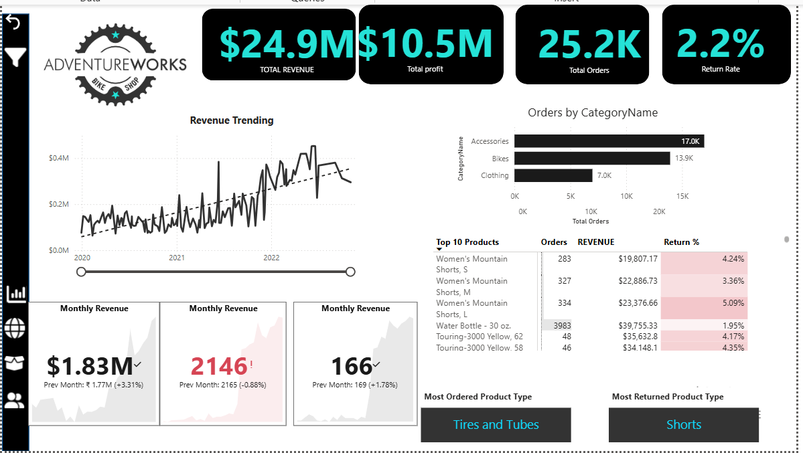
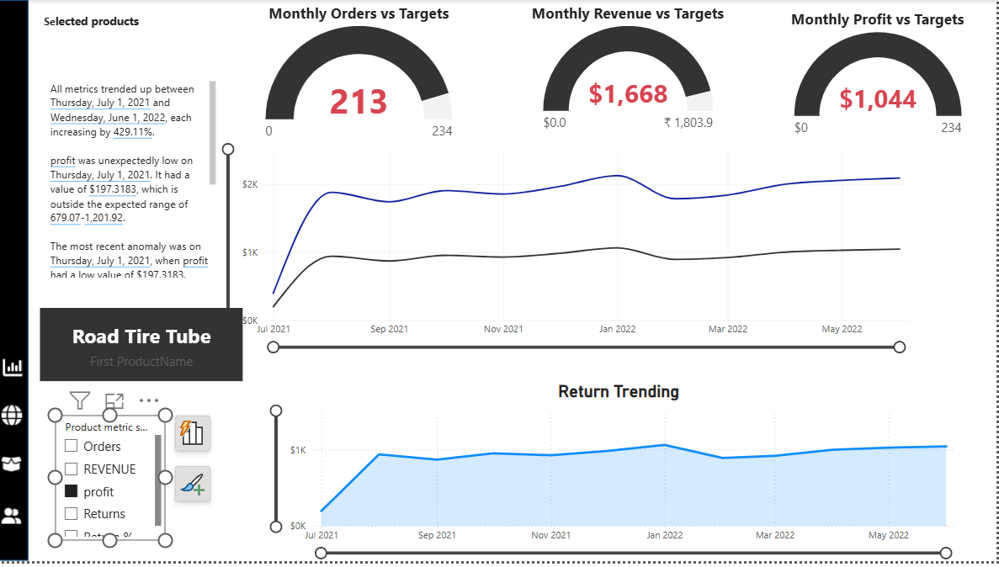
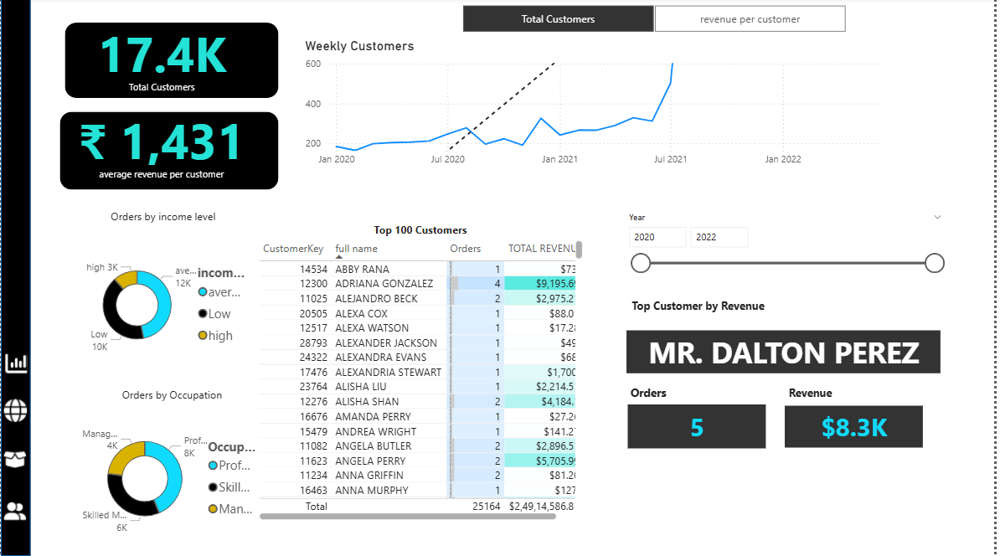

## Dashboard Preview

## Project Overview
An end-to-end Power BI dashboard analyzing sales performance, 
customer behaviour and product returns for Adventure Works Bike Shop 
across global markets from 2020 to 2022.

## Tools Used
 Power BI | Dashboard building and visualization |
 DAX | KPI calculations and time intelligence |
 Power Query | Data cleaning and transformation |
 Data Modeling | Table relationships and schema design |

## Business Questions Answered
- How is revenue and profit performing vs targets?
- Which products and regions drive the most orders?
- Which product categories have the highest return rates?
- How are customer trends changing week over week?

## Key Insights
- Total revenue of $24.9M and profit of $10.5M across global markets
- Accessories lead with 17K orders, followed by Bikes (13.9K)
- United States is the highest order country globally
- Touring Bikes have the highest return rate at 3.30%
- Revenue shows consistent upward trend from 2020 to 2022

## Visuals Used
- KPI cards and gauge charts
- Line charts for revenue and order trends
- Map visual for regional performance
- Decomposition tree and key influencers
- Matrix tables for product analysis
- Donut charts for category breakdown 
